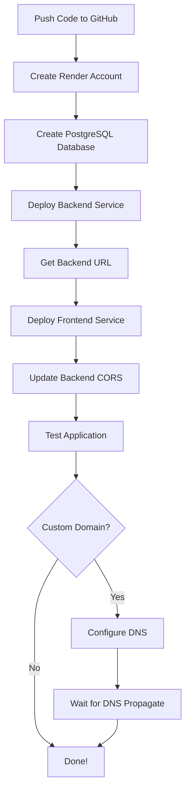

# 🚀 Marlie Nails & Spa - Deployment Documentation

## 📚 Tài Liệu Hướng Dẫn

Dự án đã được cấu hình đầy đủ để deploy lên **Render** bằng **Docker**.

### 📖 Documents Available

1. **[QUICK_DEPLOY.md](./QUICK_DEPLOY.md)** - ⚡ Hướng dẫn nhanh (5 phút đọc)
   - Tóm tắt các bước deploy
   - Danh sách files đã tạo
   - Quick reference

2. **[DEPLOYMENT_GUIDE.md](./DEPLOYMENT_GUIDE.md)** - 📋 Hướng dẫn chi tiết (đầy đủ)
   - Hướng dẫn từng bước một cách chi tiết
   - Setup database
   - Deploy frontend & backend
   - Custom domain configuration
   - Troubleshooting
   - Best practices

3. **[DEPLOY_CHECKLIST.md](./DEPLOY_CHECKLIST.md)** - ✅ Checklist trước deploy
   - Pre-deployment checks
   - Environment variables cần chuẩn bị
   - Deploy steps với checkboxes
   - Post-deployment tasks

4. **[API_CONFIG.md](./API_CONFIG.md)** - 🔧 API Configuration
   - Cách cấu hình API URL
   - Environment variables cho frontend
   - Testing API connection

## 🏗️ Architecture

```
┌─────────────────────────────────────────────────────────────┐
│                         RENDER.COM                           │
├─────────────────────────────────────────────────────────────┤
│                                                               │
│  ┌─────────────────────┐         ┌─────────────────────┐   │
│  │   Frontend Service  │         │  Backend Service    │   │
│  │   (Docker/Nginx)    │────────▶│  (Docker/NestJS)   │   │
│  │   Port: 80          │  API    │  Port: 3000         │   │
│  └─────────────────────┘  calls  └─────────────────────┘   │
│           │                               │                  │
│           │                               ▼                  │
│           │                       ┌─────────────────────┐   │
│           │                       │  PostgreSQL DB      │   │
│           │                       │  (Render Managed)   │   │
│           │                       └─────────────────────┘   │
│           │                                                  │
│  ┌────────▼──────────────────────────────────────────────┐ │
│  │              Custom Domain (Optional)                  │ │
│  │  www.yourdomain.com → Frontend                        │ │
│  │  api.yourdomain.com → Backend                         │ │
│  └────────────────────────────────────────────────────────┘ │
└─────────────────────────────────────────────────────────────┘
```

## 📁 Files Structure

```
MarlieNailsAndSpa/
│
├── backEnd/
│   ├── Dockerfile              ← Docker image cho backend
│   ├── .dockerignore           ← Exclude files từ build
│   └── src/
│       └── main.ts             ← Updated: CORS & port config
│
├── frontEnd/
│   ├── Dockerfile              ← Docker image cho frontend
│   ├── .dockerignore           ← Exclude files từ build
│   ├── nginx.conf              ← Nginx configuration
│   └── src/api/
│       └── index.ts            ← Uses VITE_API_BASE_URL env
│
├── docker-compose.yml          ← Local testing
├── render.yaml                 ← Render deployment config
│
└── Documentation/
    ├── QUICK_DEPLOY.md         ← Quick reference
    ├── DEPLOYMENT_GUIDE.md     ← Detailed guide
    ├── DEPLOY_CHECKLIST.md     ← Pre-deploy checklist
    └── API_CONFIG.md           ← API configuration
```

## 🎯 Quick Start

### Option 1: Đọc Hướng Dẫn Nhanh
```bash
# Đọc file này để bắt đầu nhanh
cat QUICK_DEPLOY.md
```

### Option 2: Follow Checklist
```bash
# Follow checklist từng bước
cat DEPLOY_CHECKLIST.md
```

### Option 3: Chi Tiết Đầy Đủ
```bash
# Đọc hướng dẫn chi tiết
cat DEPLOYMENT_GUIDE.md
```

## 🧪 Test Local Trước Khi Deploy

### Test Với Docker Compose
```bash
# Build và start tất cả services
docker-compose up --build

# Frontend: http://localhost:80
# Backend: http://localhost:3000/api
```

### Test Individual Services
```bash
# Backend
cd backEnd
docker build -t marlie-backend .
docker run -p 3000:3000 marlie-backend

# Frontend
cd frontEnd
docker build -t marlie-frontend .
docker run -p 80:80 marlie-frontend
```

## 🔑 Environment Variables

### Backend (Required)
```env
NODE_ENV=production
DB_TYPE=postgres
DB_HOST=<database-host>
DB_PORT=5432
DB_USERNAME=<db-username>
DB_PASSWORD=<db-password>
DB_NAME=<database-name>
JWT_SECRET=<32-char-random-string>
ADMIN_PASSWORD=<admin-password>
FRONTEND_URL=<frontend-url>
```

### Frontend (Required)
```env
VITE_API_BASE_URL=<backend-url>/api
```

### Generate JWT Secret
```bash
node -e "console.log(require('crypto').randomBytes(32).toString('hex'))"
```

## 🌐 Deployment Flow



## ✅ Deployment Steps (Summary)

1. **Prepare**: Push code to GitHub
2. **Database**: Create PostgreSQL on Render
3. **Backend**: Deploy backend service with Docker
4. **Frontend**: Deploy frontend service with Docker
5. **Configure**: Update CORS and API URLs
6. **Test**: Verify all functionality
7. **Domain** (Optional): Configure custom domain

## 📊 Tech Stack

### Frontend
- **Framework**: React + TypeScript
- **Build Tool**: Vite
- **Server**: Nginx (trong Docker)
- **State Management**: Redux Toolkit
- **UI**: Material-UI

### Backend
- **Framework**: NestJS + TypeScript
- **Database**: PostgreSQL (hoặc MySQL)
- **ORM**: TypeORM
- **Authentication**: JWT + Passport

### Deployment
- **Platform**: Render.com
- **Containerization**: Docker
- **Orchestration**: Docker Compose (local)

## 🔒 Security Features

- ✅ HTTPS enabled by default (Render)
- ✅ CORS configured properly
- ✅ JWT authentication
- ✅ Environment variables for secrets
- ✅ Security headers in Nginx
- ✅ Input validation

## 🎨 Features

- 📅 Booking system với multiple employees
- 👥 Customer management
- 💼 Employee management
- 💅 Service/treatment management
- ⏰ Time slot scheduling
- 🔐 Admin authentication
- 📱 Responsive design

## ⚡ Performance

- **Frontend**: 
  - Static assets caching
  - Gzip compression
  - Optimized Docker image
  
- **Backend**:
  - Multi-stage Docker build
  - Production dependencies only
  - Database connection pooling

## 💰 Cost Estimate

### Free Tier (Render)
- Frontend: Free (sleeps after 15 min inactive)
- Backend: Free (sleeps after 15 min inactive)
- Database: Free (256 MB, expires after 90 days)

### Paid Plans (để tránh sleep)
- Starter: $7/month per service
- Standard: $25/month per service
- Database: $7/month (1 GB)

## 🆘 Support

### Issues & Questions
- Check [DEPLOYMENT_GUIDE.md](./DEPLOYMENT_GUIDE.md) Troubleshooting section
- Render Documentation: https://render.com/docs
- Render Community: https://community.render.com

### Common Issues
- **Build Failed**: Check Dockerfile và logs
- **Cannot Connect DB**: Verify credentials
- **CORS Error**: Update FRONTEND_URL
- **404 on Refresh**: Check nginx.conf

## 📝 License

[Your License Here]

## 👥 Authors

[Your Name/Team]

---

## 🚀 Ready to Deploy?

1. **First Time**: Read `DEPLOYMENT_GUIDE.md`
2. **Quick Deploy**: Follow `QUICK_DEPLOY.md`
3. **Checklist**: Use `DEPLOY_CHECKLIST.md`

**Good luck! 🎉**
