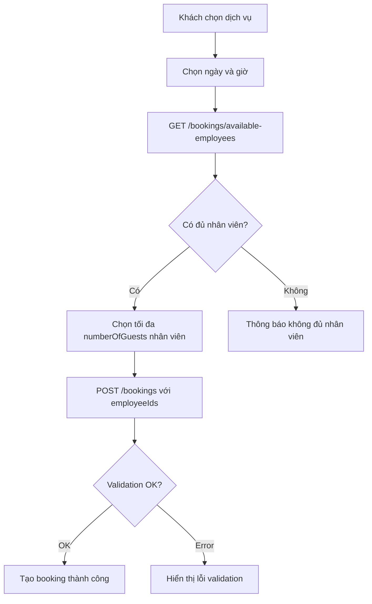

# 📋 Multiple Employees Booking - Hướng Dẫn Sử Dụng

## 🎯 Tính Năng

Hệ thống cho phép chọn **nhiều nhân viên** khi tạo booking, với các quy tắc:

1. **Số lượng nhân viên ≤ Số lượng khách**: Nếu `numberOfGuests = 3`, có thể chọn tối đa 3 nhân viên
2. **Chỉ chọn nhân viên available**: Nhân viên đã được booking trong cùng khung giờ sẽ không thể chọn
3. **Không trùng lặp**: Không thể chọn cùng 1 nhân viên nhiều lần

## 📊 Database Schema

### Bảng: `booking_employees` (Many-to-Many)

```sql
CREATE TABLE `booking_employees` (
  `id` varchar(36) PRIMARY KEY,
  `bookingId` varchar(255) NOT NULL,
  `employeeId` varchar(255) NOT NULL,
  `createdAt` datetime(6) NOT NULL,
  FOREIGN KEY (`bookingId`) REFERENCES `bookings`(`id`) ON DELETE CASCADE,
  FOREIGN KEY (`employeeId`) REFERENCES `employees`(`id`)
);
```

## 🔧 API Changes

### 1. Create Booking - ĐÃ THAY ĐỔI

**Endpoint:** `POST /bookings`

**Request Body (CŨ):**

```json
{
  "customerId": "uuid",
  "serviceId": "uuid",
  "employeeId": "uuid", // ❌ DEPRECATED - 1 nhân viên
  "bookingDate": "2024-01-25",
  "timeSlotId": "uuid",
  "numberOfGuests": 3,
  "totalPrice": 1500000
}
```

**Request Body (MỚI):**

```json
{
  "customerId": "uuid",
  "serviceId": "uuid",
  "employeeIds": ["uuid1", "uuid2", "uuid3"], // ✅ Array - nhiều nhân viên
  "bookingDate": "2024-01-25",
  "timeSlotId": "uuid",
  "numberOfGuests": 3,
  "totalPrice": 1500000
}
```

**Response:**

```json
{
  "status": 200,
  "data": {
    "id": "booking-uuid",
    "customer": { ... },
    "service": { ... },
    "bookingEmployees": [
      {
        "id": "be-uuid-1",
        "employee": {
          "id": "emp-uuid-1",
          "fullName": "Nguyễn Thị Mai",
          "role": "therapist"
        }
      },
      {
        "id": "be-uuid-2",
        "employee": {
          "id": "emp-uuid-2",
          "fullName": "Trần Văn B",
          "role": "therapist"
        }
      }
    ],
    "timeSlot": { ... },
    "bookingDate": "2024-01-25",
    "numberOfGuests": 3,
    "status": "pending"
  },
  "message": "Tạo booking thành công"
}
```

### 2. Get Available Employees - KHÔNG THAY ĐỔI

**Endpoint:** `GET /bookings/available-employees?date=2024-01-25&timeSlotId=uuid`

**Response:**

```json
{
  "status": 200,
  "data": {
    "date": "2024-01-25",
    "timeSlotId": "timeslot-uuid",
    "totalEmployees": 10,
    "bookedEmployees": 3,
    "availableEmployees": [
      {
        "id": "emp-uuid-1",
        "fullName": "Nguyễn Thị Mai",
        "email": "mai@spa.com",
        "role": "therapist",
        "specialization": "Massage Body"
      },
      {
        "id": "emp-uuid-2",
        "fullName": "Trần Văn B",
        "email": "tranvanb@spa.com",
        "role": "therapist",
        "specialization": "Foot Massage"
      }
    ]
  },
  "message": "Lấy danh sách nhân viên khả dụng thành công"
}
```

## ✅ Validation Rules

### 1. Số lượng nhân viên ≤ Số lượng khách

**Request:**

```json
{
  "numberOfGuests": 2,
  "employeeIds": ["uuid1", "uuid2", "uuid3"] // 3 nhân viên
}
```

**Error Response:**

```json
{
  "statusCode": 400,
  "message": "Số lượng nhân viên (3) không được vượt quá số lượng khách (2)",
  "error": "Bad Request"
}
```

### 2. Nhân viên phải available

**Request:**

```json
{
  "employeeIds": ["uuid1", "uuid2"] // uuid1 đã bị book
}
```

**Error Response:**

```json
{
  "statusCode": 409,
  "message": "Nhân viên Nguyễn Thị Mai đã có lịch hẹn trong khung giờ này",
  "error": "Conflict"
}
```

### 3. Không đủ nhân viên available

**Request:**

```json
{
  "employeeIds": ["uuid1", "uuid2", "uuid3", "uuid4"] // Chỉ có 2 available
}
```

**Error Response:**

```json
{
  "statusCode": 409,
  "message": "Chỉ còn 2 nhân viên trống trong khung giờ này",
  "error": "Conflict"
}
```

### 4. Trùng lặp ID nhân viên

**Request:**

```json
{
  "employeeIds": ["uuid1", "uuid1", "uuid2"] // uuid1 bị trùng
}
```

**Error Response:**

```json
{
  "statusCode": 400,
  "message": "Danh sách nhân viên có ID trùng lặp",
  "error": "Bad Request"
}
```

## 📝 Use Cases

### Use Case 1: Booking cho 1 người với 1 nhân viên

```json
POST /bookings
{
  "customerId": "customer-uuid",
  "serviceId": "massage-service-uuid",
  "employeeIds": ["emp-uuid-1"],
  "bookingDate": "2024-01-25",
  "timeSlotId": "9am-10am-uuid",
  "numberOfGuests": 1,
  "totalPrice": 500000
}
```

### Use Case 2: Booking cho 3 người với 3 nhân viên

```json
POST /bookings
{
  "customerId": "customer-uuid",
  "serviceId": "massage-service-uuid",
  "employeeIds": ["emp-uuid-1", "emp-uuid-2", "emp-uuid-3"],
  "bookingDate": "2024-01-25",
  "timeSlotId": "9am-10am-uuid",
  "numberOfGuests": 3,
  "totalPrice": 1500000
}
```

### Use Case 3: Booking cho 5 người với 2 nhân viên

```json
POST /bookings
{
  "customerId": "customer-uuid",
  "serviceId": "massage-service-uuid",
  "employeeIds": ["emp-uuid-1", "emp-uuid-2"],
  "bookingDate": "2024-01-25",
  "timeSlotId": "9am-10am-uuid",
  "numberOfGuests": 5,
  "totalPrice": 2500000,
  "notes": "2 nhân viên phục vụ 5 khách"
}
```

### Use Case 4: Booking không chọn nhân viên (Optional)

```json
POST /bookings
{
  "customerId": "customer-uuid",
  "serviceId": "massage-service-uuid",
  "employeeIds": [],  // Hoặc không truyền field này
  "bookingDate": "2024-01-25",
  "timeSlotId": "9am-10am-uuid",
  "numberOfGuests": 2,
  "totalPrice": 1000000
}
```

## 🔄 Workflow



## 🎨 Frontend Example (React/Vue)

```javascript
// 1. Lấy danh sách nhân viên available
const getAvailableEmployees = async (date, timeSlotId) => {
  const response = await fetch(
    `/bookings/available-employees?date=${date}&timeSlotId=${timeSlotId}`,
  );
  const result = await response.json();
  return result.data.availableEmployees;
};

// 2. Tạo booking với nhiều nhân viên
const createBooking = async (bookingData) => {
  const response = await fetch('/bookings', {
    method: 'POST',
    headers: { 'Content-Type': 'application/json' },
    body: JSON.stringify({
      customerId: bookingData.customerId,
      serviceId: bookingData.serviceId,
      employeeIds: bookingData.selectedEmployeeIds, // Array of IDs
      bookingDate: bookingData.date,
      timeSlotId: bookingData.timeSlotId,
      numberOfGuests: bookingData.numberOfGuests,
      totalPrice: bookingData.totalPrice,
    }),
  });

  return await response.json();
};

// 3. UI Component logic
const BookingForm = () => {
  const [numberOfGuests, setNumberOfGuests] = useState(1);
  const [availableEmployees, setAvailableEmployees] = useState([]);
  const [selectedEmployeeIds, setSelectedEmployeeIds] = useState([]);

  const handleEmployeeSelect = (employeeId) => {
    if (selectedEmployeeIds.length >= numberOfGuests) {
      alert(`Chỉ được chọn tối đa ${numberOfGuests} nhân viên`);
      return;
    }

    if (selectedEmployeeIds.includes(employeeId)) {
      // Deselect
      setSelectedEmployeeIds((prev) => prev.filter((id) => id !== employeeId));
    } else {
      // Select
      setSelectedEmployeeIds((prev) => [...prev, employeeId]);
    }
  };

  return (
    <div>
      <label>Số lượng khách: {numberOfGuests}</label>
      <input
        type="number"
        value={numberOfGuests}
        onChange={(e) => setNumberOfGuests(e.target.value)}
      />

      <div>
        <h3>Chọn nhân viên (tối đa {numberOfGuests})</h3>
        {availableEmployees.map((emp) => (
          <div key={emp.id}>
            <input
              type="checkbox"
              checked={selectedEmployeeIds.includes(emp.id)}
              onChange={() => handleEmployeeSelect(emp.id)}
              disabled={
                !selectedEmployeeIds.includes(emp.id) &&
                selectedEmployeeIds.length >= numberOfGuests
              }
            />
            <label>
              {emp.fullName} - {emp.specialization}
            </label>
          </div>
        ))}
      </div>

      <p>
        Đã chọn: {selectedEmployeeIds.length}/{numberOfGuests}
      </p>
    </div>
  );
};
```

## 🔍 Query Examples

### Lấy tất cả booking với danh sách nhân viên

```sql
SELECT
  b.id,
  b.bookingDate,
  c.fullName as customerName,
  GROUP_CONCAT(e.fullName SEPARATOR ', ') as employeeNames
FROM bookings b
LEFT JOIN customers c ON b.customerId = c.id
LEFT JOIN booking_employees be ON b.id = be.bookingId
LEFT JOIN employees e ON be.employeeId = e.id
WHERE b.bookingDate = '2024-01-25'
GROUP BY b.id;
```

## 📌 Notes

- Field `employeeId` trong bảng `bookings` vẫn giữ lại để tương thích backward (legacy)
- Nên dùng `employeeIds` (array) cho tất cả booking mới
- Nếu không truyền `employeeIds` hoặc truyền array rỗng `[]`, booking vẫn được tạo nhưng không assign nhân viên nào

---

**Last Updated**: January 2026
